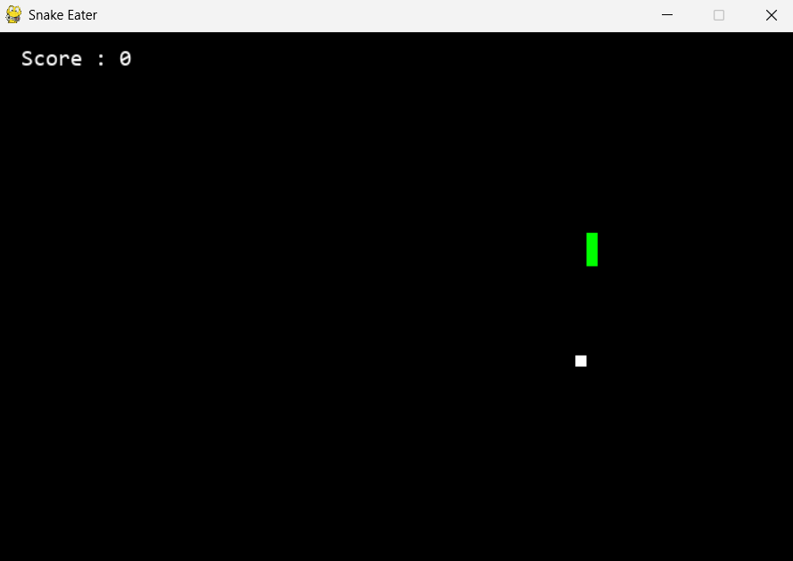

# 🐍 Snake Eater
A classic Snake game clone built with Python and Pygame. Guide your snake to eat the white squares (food), grow longer, and try not to crash into the walls or yourself. Simple mechanics, endless fun.
 
# 🎮 Features
Classic snake gameplay with keyboard controls
 
Score tracking
 
Game-over screen with restart on relaunch
 
Customizable difficulty and window size
 
# 📦 Requirements
Python 3.x
 
Pygame
 
Install dependencies with:
 
pip install pygame 

# 🚀 How to Run
python snake.py 

# 🎮 Controls
W / Up Arrow – Move Up
 
S / Down Arrow – Move Down
 
A / Left Arrow – Move Left
 
D / Right Arrow – Move Right
 
ESC – Quit Game
 
# 🛠️ Customization
You can tweak the following variables in the script:
 
python
difficulty = 25  # Game speed
frame_size_x = 720  # Width of game window
frame_size_y = 480  # Height of game window 
# 📸 Screenshot

 
# 📄 License
This project is open-source and free to use under the MIT License.
